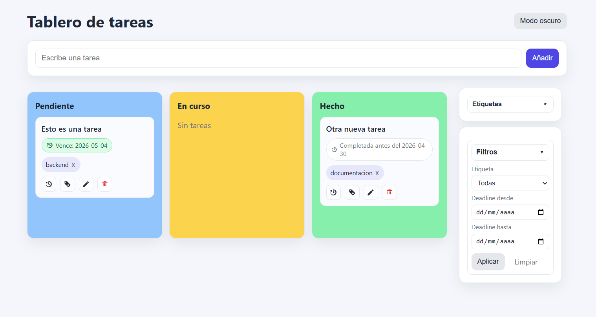

# 🐍 Curso de Python - Santander Open Academy

Este directorio contiene los proyectos y ejercicios desarrollados durante mi formación complementaria en Python. El enfoque principal de este trayecto fue la **colaboración con Agentes de IA** para optimizar el flujo de trabajo y la calidad del código.

## 🤖 Desarrollo Asistido por Agentes
A diferencia del desarrollo tradicional, en estos proyectos implementé una metodología de **AI-Assisted Development**, utilizando agentes para:
* **Generación y Refactorización**: Iteración de lógica compleja mediante prompts para asegurar un código más limpio y eficiente.
* **Context Awareness**: Uso del agente para analizar el contexto global del proyecto y sugerir integraciones coherentes entre los microservicios de Flask y la lógica de negocio.
* **Debugging Proactivo**: Identificación rápida de cuellos de botella y errores de sintaxis asistida por IA.

## 🛠️ Cómo ejecutar los proyectos
Para correr estas aplicaciones localmente:

### 1. Preparar el Entorno Virtual
Es recomendable usar un `venv` para mantener las dependencias aisladas:
```powershell
# Crear el entorno
python -m venv venv

# Activar en Windows (PowerShell)
.\venv\Scripts\activate
```

### 2. Ejecutar Aplicación Web (Flask)
```powershell
cd gestor_tareas_flask
python app.py
```

> 💡 Una vez iniciado, accedé a: `http://127.0.0.1:5000`

### 3. Scripts de Consola

```powershell
# Calculadora simple
python calculadora.py

# Procesador de texto
python contador_palabras/contador.py
```
---

## 📂 Estructura del Repositorio

| Directorio / Archivo | Descripción Técnica |
| :--- | :--- |
| gestor_tareas_flask/ | Web App con arquitectura basada en rutas dinámicas y persistencia de datos en formato JSON. |
| contador_palabras/ | Módulo de procesamiento de strings y manipulación de archivos de texto (.txt). |
| fizzBuzz.py | Resolución de lógica algorítmica clásica. |
| ejercicio_autocompletar.py | Implementación de lógica de predicción y autocompletado de datos. | 

### Preview: Gestor de Tareas

